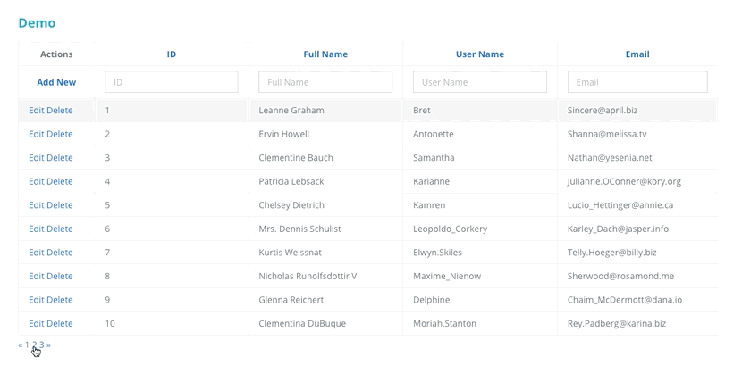

Extension of Akveo's component

##Features added by this fork

* Show cells as view mode when they are not editable in edit mode
* Custom function for determining whether cell is editable. Exposes Cell object so you can use data to determine if you want (isEditableFunction)
* Event emitter for when an auto-complete cell is completed (a choice is made). The event includes the row so you can insert data based on completion chosen (use row.setData())
* Custom select actions
* Some settings booleans for hiding/showing custom action components in edit mode and new row form and hiding the update/cancel button in editing
* Event emitter for when an input's value changes
* Settings function for adding css classes to individual cells 


### Demo

<a target="_blank" href="https://jkon.github.io/ng2-smart-table/">Live Demo</a>



## Installation

The library is available as npm package, so all you need to do is to run the following command:

```
npm install --save ng2-smart-table-extended
```

This command will create a record in your `package.json` file and install the package into the npm modules folder.

## Minimal Setup Example

First thing you need to do is to import the ng2-smart-table-extended directives into your component.

```

import { Ng2SmartTableModule } from 'ng2-smart-table-extended';

```

Then register it by adding to the list of directives of your module:

```
// ...

@NgModule({
  imports: [
    // ...
    
    Ng2SmartTableModule,
    
    // ...
  ],
  declarations: [ ... ]
})
// ...
```

Now, we need to configure the table and add it into the template. The only <strong>required</strong> setting for the component to start working is a columns configuration.
Let's register <i>settings</i> property inside of the component where we want to have the table and configure some columns [Settings documentation](https://jkon.github.io/ng2-smart-table/#/documentation):
    
```
settings = {
  columns: {
    id: {
      title: 'ID'
    },
    name: {
      title: 'Full Name'
    },
    username: {
      title: 'User Name'
    },
    email: {
      title: 'Email'
    }
  }
};
```

Finally let's put the ng2-smart-table component inside of the template:

```
// ...

@Component({
  template: `
    <ng2-smart-table [settings]="settings"></ng2-smart-table>
  `
})
// ...
```
At this step you will have a minimal configured table. All functions are available by default and you don't need to configure them anyhow, so now you can add/edit/delete rows, sort or filter the table, etc.
 
Still it seems like something is missing... Right, there is no data in the table by default. To add some, let's create an array property with a list of objects in the component. Please note that object keys are the same as in the columns configuration.

```
data = [
  {
    id: 1,
    name: "Leanne Graham",
    username: "Bret",
    email: "Sincere@april.biz"
  },
  {
    id: 2,
    name: "Ervin Howell",
    username: "Antonette",
    email: "Shanna@melissa.tv"
  },
  
  // ... list of items
  
  {
    id: 11,
    name: "Nicholas DuBuque",
    username: "Nicholas.Stanton",
    email: "Rey.Padberg@rosamond.biz"
  }
];
```

And pass the data to the table:

```
// ...

@Component({
  template: `
    <ng2-smart-table [settings]="settings" [source]="data"></ng2-smart-table>
  `
})
// ...
```

Now you have some data in the table.
 
## Further Documentation
Installation, customization and other useful articles: https://jkon.github.io/ng2-smart-table/


## Features
* Local data source (Server/API DataSource is on its way)
* Filtering
* Sorting
* Pagination
* Inline Add/Edit/Delete
* Flexible event model

## License
[MIT](LICENSE.txt) license.

